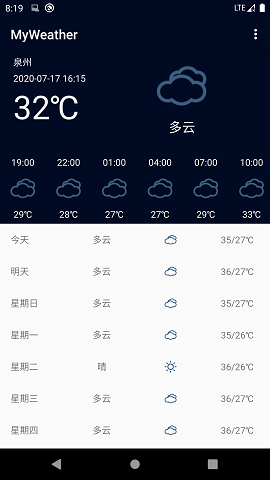

# SimpleWeatherApp
一个简单的安卓天气应用，数据来源为和风天气。

### 使用

1. 注册和风天气的key，替换掉FetchItemsTask.java中的key值。
2. 注册高德地图的key，替换掉AndroidManifest.xml中的key值。 

### 效果

### TODO

- [x] 使用okhttp替换HttpURLConnection
- [ ] 完善支持华氏度单位的功能
- [ ] 保存离线数据，当无网络连接时就显示离线数据
- [ ] 多标签页显示多个城市的天气
  - [x] 城市列表
  - [x] 城市选择
  - [ ] 多标签页(ViewPager + CircleIndicator)
- [ ] 美化界面

### 参考

1. [CityPickerX](https://github.com/zhuxu1/CityPickerX)